# Deploy a financial microservice on LinuxONE using IBM Cloud Private 

In this Code Pattern, you will learn how to build and deploy a banking microservice with IBM Cloud private running in the LinuxONE Community Cloud. 

IBM Cloud Private is a private cloud platform for developing and running workloads locally. It is an integrated environment that enables you to design, develop, deploy and manage on-premises, containerized cloud applications behind a firewall. It includes the container orchestrator Kubernetes, a private image repository, a management console and monitoring frameworks.

When you will complete this Code Pattern, you will understand how to:

* Build a Docker image from an existing application.
* Deploy a Docker image to IBM Cloud Private.
* Run the existing application using the IBM Cloud Private catalog.

# Architecture

This journey accesses a fictitious retail banking system called MPLbank. MPLbank integrates an Account Management System running on IBM Mainframe. On top of this component, an API layer based on z/OS Connect EE and IBM API Connect has been set up to deliver banking APIs. It makes banking services reachable through APIs from all kind of applications. IBM Cloud private has been configured into the LinuxONE  Community Cloud.

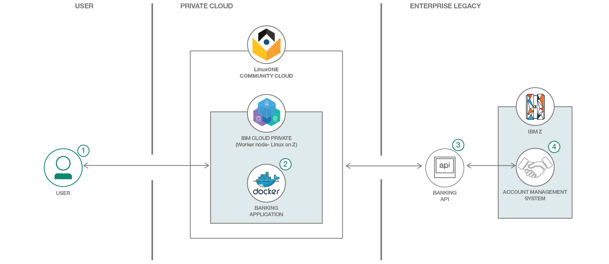

1. The user deploys a Docker image (banking application based microservice) to the IBM Cloud Private Docker registry.
2. The user configures and runs a container based on the previous Docker image from IBM Cloud Private catalog. Once started, the application calls banking APIs published in API Connect.
3. API Connect calls the back-end Z Mainframe through a banking API published in z/OS Connect EE.
4. z/OS Connect EE calls the Account Management System (AMS) running in CICS. A COBOL program processes the request and returns banking data. Finally, banking data are sent back to the microservice application.

# Included components

* [IBM Cloud private](https://www.ibm.com/cloud/private)
* [IBM API Connect](http://www-03.ibm.com/software/products/en/api-connect)
* [IBM z/OS Connect Enterprise Edition](https://www.ibm.com/us-en/marketplace/connect-enterprise-edition)
* [IBM CICS Tansaction Server](https://www.ibm.com/us-en/marketplace/cics-transaction-server#product-header-top)
* [IBM Db2](https://www.ibm.com/analytics/db2/zos)

# Featured technologies

* [Docker](https://www.Docker.com/)
* [Microservice](https://www.ibm.com/cloud/garage/architectures/microservices/)
* [IBM LinuxONE](https://www.ibm.com/it-infrastructure/LinuxONE)
* [IBM Z Mainframe](https://www.ibm.com/it-infrastructure/z)

# Steps

<!-- https://ecotrust-canada.github.io/markdown-toc/ -->

### Step 1 - Discover and locally run the banking application

- [Part 1 - Discover the banking application](#part-1---discover-the-banking-application)
- [Part 2 - Subscribe to the banking API through the API Developer Portal](#part-2---subscribe-to-the-banking-api-through-the-api-developer-portal)
- [Part 3 - Run the banking application with Node.js](#part-3---run-the-banking-application-with-nodejs)
- [Part 4 - Push the banking application to your GitHub repository](#part-4---push-the-banking-application-to-your-github-repository)

### Step 2 - Build and deploy a Docker image to IBM Cloud private

- [Part 1 - Build the Docker image from the LinuxONE Community Cloud](#part-1---build-the-docker-image-from-the-LinuxONE-community-cloud)
- [Part 2 - Deploy the Docker image to IBM Cloud private](#part-2---deploy-the-docker-image-to-ibm-cloud-private)

### Step 3 - Instantiate the banking microservice from the IBM Cloud private catalog

- [Part 1 - Discover the Helm chart from the calalog](#part-1---discover-the-helm-chart-from-the-calalog)
- [Part 2 - Configure and install your banking microservice](#part-2---configure-and-install-your--microservice)
- [Part 3 - Access your banking microservice](#part-3---access-your-banking-microservice)

---

# Step 1 - Discover and locally run the banking application

The objective is to discover the banking application located in the *banking-application* folder. This application is a Node.js application. It will be locally tested before packaging it into a Docker image for IBM Cloud private.

## Part 1 - Discover the banking application

1. Create a [GitHub account](https://github.com/).

	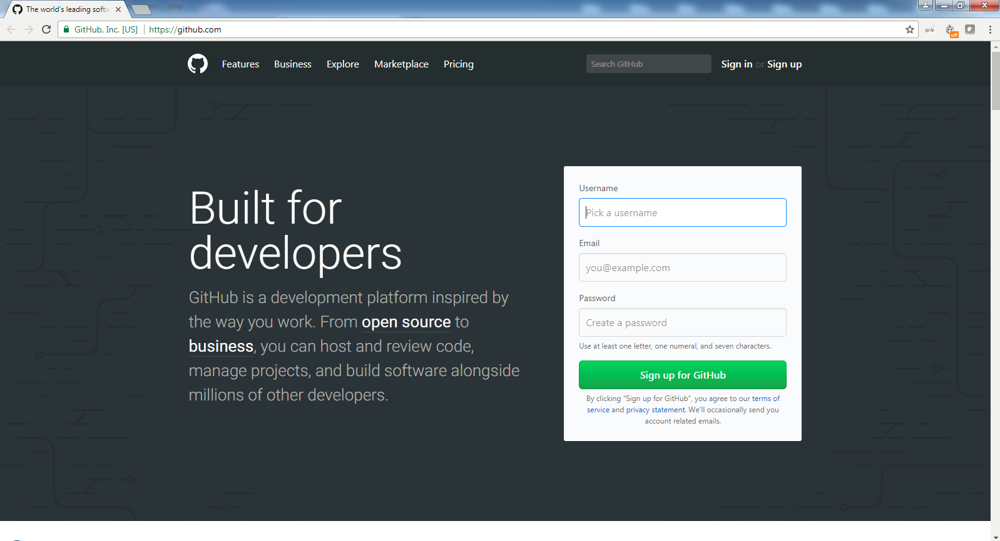
	* Pick a username. This will be referenced later as "YOUR_USERNAME".
	* Enter an email.
	* Create a password.
	* Click **Sign up for GitHub**.
	* Select the plan *Unlimited public repositories for free*.
	* A Confirmation email will be sent. Verify your email address to collaborate in Github.

2. Fork the banking application from this GitHub repository to your own GitHub repository.

	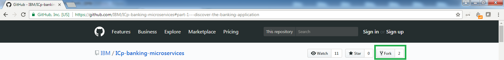
	* Click **Fork**.
	* Github automatically forks this project from this repository *IBM/ICp-banking-microservices* to your repository *YOUR_USERNAME/ICp-banking-microservices*.
	* Discover your forked project (your fresh banking application) in your Github repository *YOUR_USERNAME/ICp-banking-microservices*.

3. Install the [Git command line interface](https://git-scm.com/book/en/v2/Getting-Started-The-Command-Line) to manage your GitHub repository. Git has three main commands:
	* *git clone* is the command for creating a local copy of the source code from a GitHub repository.
	* *git pull* is the command for pulling fresh code from a GitHub repository.
	* *git push* is the command for pushing new code to a GitHub repository.

4. Launch a terminal and clone your GitHub repository *ICp-banking-microservices* to create a local copy of your banking application:

   `git clone https://github.com/YOUR_USERNAME/ICp-banking-microservices`
    
	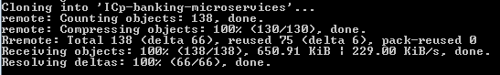
	
5. Import the source code into your favorite IDE and take a look at the *banking-application* folder:

	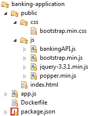
	* *app.js*: the application server code.
	* *public/index.html*: the application client code (banking dashboard).
	* *public/css*: the application stylesheet.
	* *public/js*: the JavaScript libraries. *bankingAPI.js* will be modified later to connect the banking application to a real corebanking system through API calls (part 2).
	* *package.json*: the package dependencies file.
	* *Dockerfile*: file to build the Docker image. it will be used later (step 2).

## Part 2 - Subscribe to the banking API through the API Developer Portal

1. Sign up for an [IBM ID] if you don't have one already.

2. Go to the [API Developer Portal].

3. Create an account if you have not done that already.

	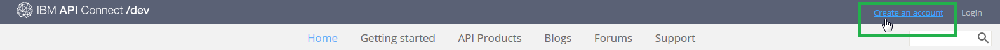
   * Click **Create an Account**.
   * Provide all required information. Be sure to use your IBM ID (email address) for this account.
   * Click **Submit**.

  
   An account activation email will be sent to your registered IBM ID email. Click on the link in this email to activate your account.

4. Login to your account.

5. Create a new application.
	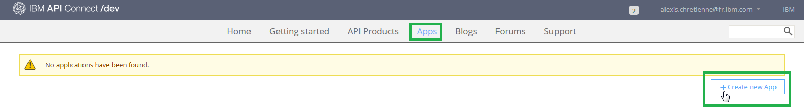
	* Click **Apps** from the menu.
	* Click **Create new App**.
	* Fill in all the required fields.
	* Click **Submit**.
	
	Make a note of the *client ID* and *client Secret*. You will need them to access the API later.
	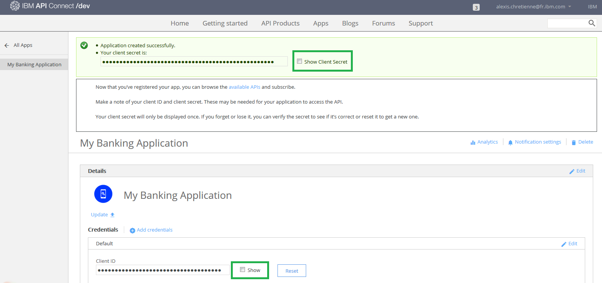

6. Before working with the banking API, you need to subscribe to it first. Display the list of available API products.
	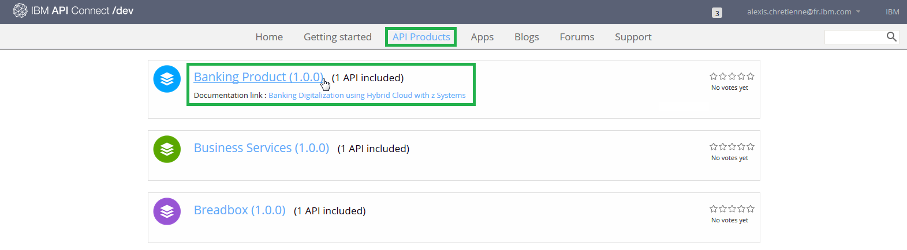
	* Click **API Products** from the top menu.
	* Click **Banking Product** in the list.

7. Subscribe to the Banking API.
	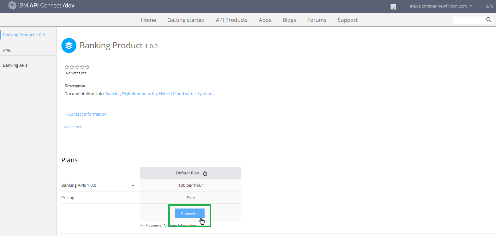
	* Click **Subscribe** to the Default Plan.
	
	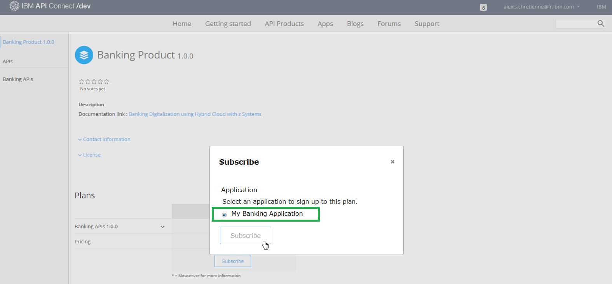
	* Select the App that you have just created before.
	* Click **Subscribe**.
	
8. Modify the *banking-application/public/js/bankingAPI.js* in your banking application.
	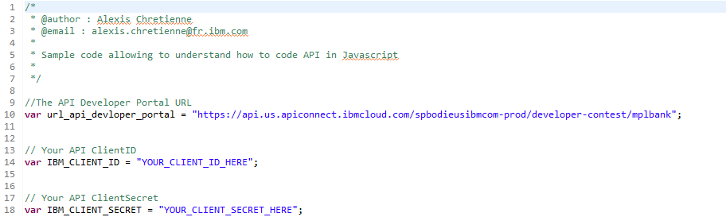
	* Replace *YOUR_CLIENT_ID_HERE* by your client ID value from the IBM API developer portal.
	* Replace *YOUR_CLIENT_SECRET_HERE* by your client Secret value from the IBM API developer portal.

## Part 3 - Run the banking application with Node.js

1. Install these required components for your environment (Windows, Mac OS, Linux):
	*	[Node.js](https://nodejs.org/en/): Node.js is a javascript application server and will run the banking application.
	* 	[npm](https://www.npmjs.com/get-npm): npm resolves Node.js package dependencies. According to your operating system, npm may be distributed with Node.js.

3. Launch a terminal and test if Node.Js and npm are installed in your operating system and added to the system path:
	
	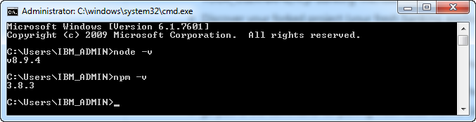
	* Run the command *node -v*. The version is displayed.
	* Run the command *npm -v*. The version is displayed.

3. In the same terminal. Go to your banking application folder:

    `cd ICp-banking-microservices/banking-application`

4. Install Node.Js package dependencies of the banking application using : `npm install`
	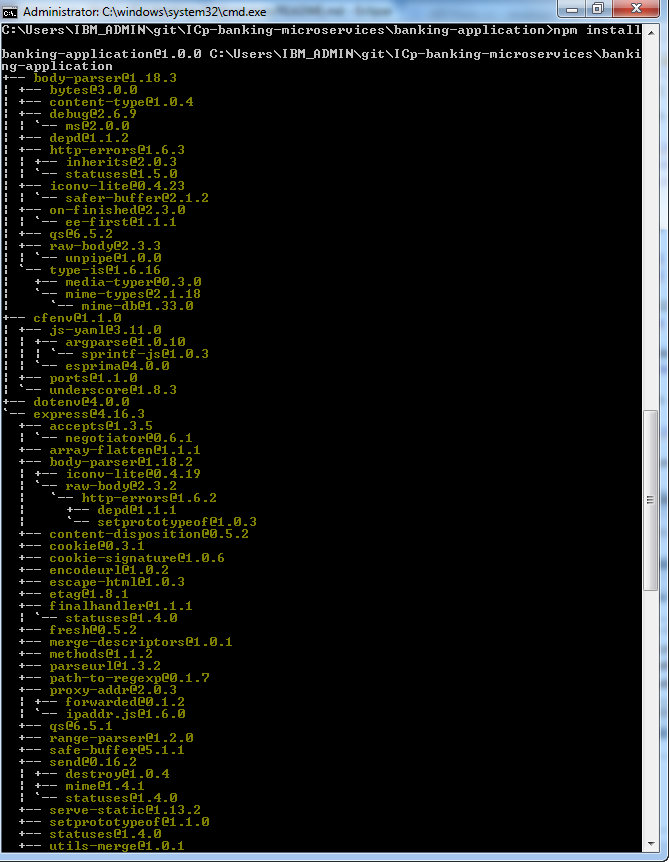
	* As a result, dependencies are installed in your project folder.

5. Run the banking application using : `node app.js` :
	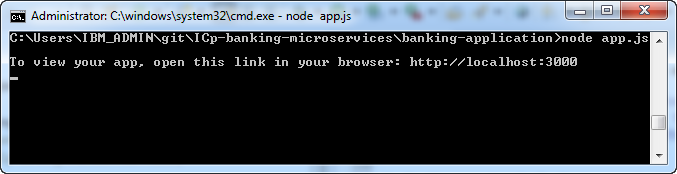
	* As a result, The banking application is started.
	
4. Launch a web browser and go to **localhost:3000**. The banking application appears.
    
	

5. Test your application.

	
    * Select a customer ID.
    * Please wait while the application calls banking data from the Mainframe through API Connect and z/OS Connect EE.
    * The result is displayed in a JSON structure.
    
6. The banking application locally works. Stop the Node.js server with a **SIGINT (CTRL+C)** from the terminal.

## Part 4 - Push the banking application to your GitHub repository

1. Add the *bankingAPI.js* file you just modified to the current content index:

	`git add public/js/bankingAPI.js`

2. Commit the fresh code you modified to add changes to the local repository:

   `git commit -m "Update of bankingAPI.js"`

3. Push the code you commited to transfer the last commit to your GitHub repository *ICp-banking-microservices*:

   `git push`

4. Go back to your online Github repository *ICp-banking-microservices* using the web browser. 

	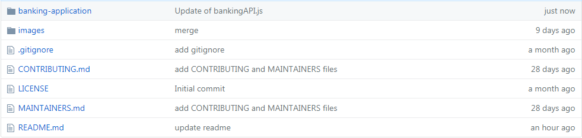
	* Check that your code has been updated with commit label *Update of BankingAPI.js*

---

:thumbsup: Congratulations! Your banking application locally works and modifications have been pushed to your GitHub repository! Ready for IBM Cloud private?

---

# Step 2 - Build and deploy a Docker image to IBM Cloud private

The objective is to build a Docker image from the banking application and then deploy it to the IBM Cloud private.

## Part 1 - Build the Docker image from the LinuxONE Community Cloud

Docker can build images automatically by reading the instructions from a Dockerfile. A Dockerfile is a text document that contains all the commands a user could call on the command line to assemble an image. Using Docker build, users can create an automated build that executes several command-line instructions, step by step.

1. Create your LinuxONE virtual server to build the Docker image from the LinuxONE Community Cloud following the [virtual Server Deployment Guide](https://github.com/LinuxONE-community-cloud/technical-resources/blob/master/deploy-virtual-server.md): 

	1. You will request access to LinuxONE Community Cloud.
	2. You will make a first time setup (select SLES12SP3)
	3. You will deploy your LinuxONE virtual server.
	4. You will log in to your LinuxONE virtual server using SSH.
	
	As a result, you have your LinuxONE virtual server (SLES12SP3) created (**YOUR_LINUX_IP** is your LinuxONE virtual server IP Adress)
	
	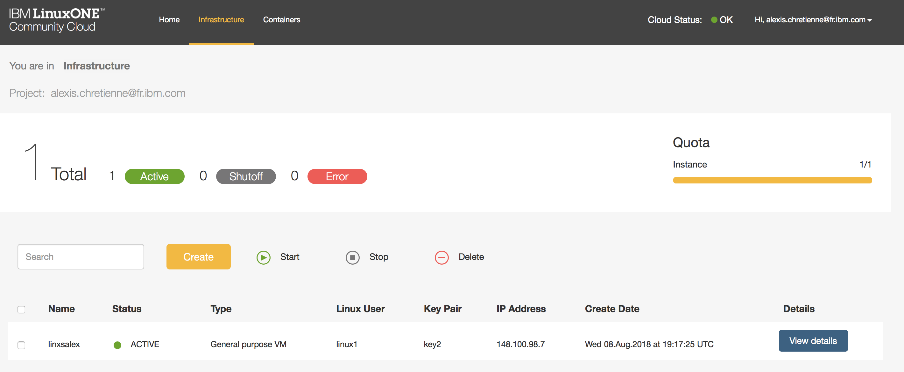
	
2. Once logged in with SSH, clone your fresh source code from your *YOUR_USERNAME/ICp-banking-microservices* Github repository into your LinuxONE virtual server:

	`git clone YOUR_USERNAME/ICp-banking-microservices`

3. Take a look at the *ICp-banking-microservices/banking-application/Dockerfile* file:

	`cat ICp-banking-microservices/banking-application/Dockerfile`

	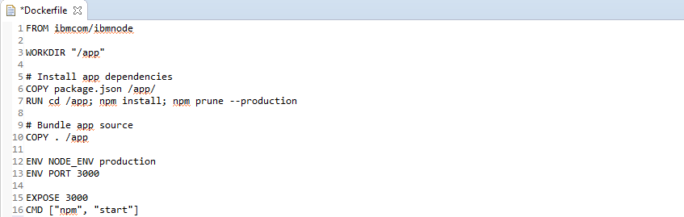
	* *FROM ibmcom/ibmnode*: This command gathers, from IBM's public Docker repository, a Ubuntu Linux image containing all the basic components to run a Node.js application. It will be used as a basis for our usecase. 
	* *WORKDIR "/app"*: This command creates a directory inside our image, from which we will inject our specific files.
	* *COPY package.json /app/*: This command copies our **package.json** file into the working directory inside our image. This file holds information about the app, most importantly the package dependencies it will need.
	* *RUN cd /app; npm install; npm prune --production*: These commands first move our focus to the working directory, then download and install our app's required dependencies.
	* *COPY . /app*: This command copies everything left of the app into our working directory inside the Docker image, i.e. our app's source code.
	* *ENV NODE_ENV production* and *ENV PORT 3000*: These two commands set environment variables. The first one tells our Node.js instance that we run in production mode, and thus don't need development libraries. The other one sets the port 3000 as our main networking port.
	* *EXPOSE 3000*: This command tells Docker to map the image's port 3000 to the operating system's port 3000. It will gives us a network access to the Docker image and thus the Node.js app.
	* *CMD ["npm", "start"]*: This last command tells Docker what to do when we launch the image, in our case **npm start**, which will start the Node.js app.
	
4. Build your Docker image:

	`sudo docker build -t "YOUR_USERNAME-banking-image:latest" .`
	
5. As a result, a Docker image is created based on your Dockerfile and your source code pulled from Github :

	`sudo docker images`
	
6. Create manually a new container based on your fresh Docker image:

	`sudo docker run -p 3000:3000 YOUR_USERNAME-banking-image`
	
	
4. Launch a web browser and go to **YOUR_LINUX_IP:3000**. The banking application appears.
    
	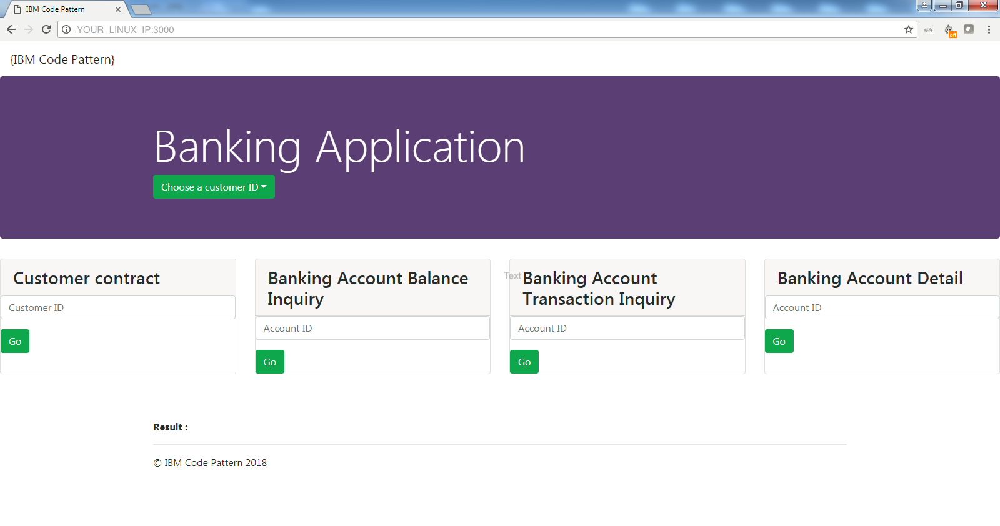

5. Test your application.

	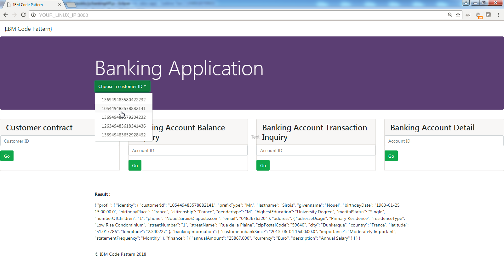
    * Select a customer ID.
    * Please wait while the application calls banking data from the Mainframe through API Connect and z/OS Connect EE.
    * The result is displayed in a JSON structure.

## Part 2 - Deploy the Docker image to IBM Cloud private

In this Code Pattern, an default automatic process (Jenkins build) has been set up for you to deploy the Docker image to ICp. 

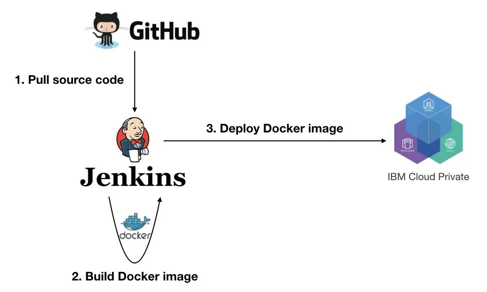

The Jenkins build processed as follow:

1. Jenkins pulled the source code from a GitHub repository *YOUR_USERNAME/ICp-banking-microservices* like yours.
2. Jenkins built the Docker image from the Docker file described before. It has been called **cluster68.icp:8500/codepatterns/code-pattern-icp-banking-microservices** and tagged *lastest*.
3. Jenkins connected to ICp and then deployed the Docker image to its Docker image repository.
	
> NOTE: If you are practicing this pattern during an IBM event like SHARE or Think, you are authorized to practice this deployment. Otherwise, go to the next step:
>
> 4. Copy and Paste this URL into your browser address bar : `http://URL_CICD_SERVER/deploy/GITHUB_USERNAME` 
>	
>	* Ask the URL_CICD_SERVER to the IBMer managing the lab session.
>	* Replace *GITHUB_USERNAME* with your username.
>
> 5. Click **Enter**. The deployment is processing : 
> 	* The process pulls your source code from your GitHub repository *YOUR_USERNAME/ICp-banking-microservices*.
> 	* The process builds the Docker image from the Docker file described before. It has been called **YOUR_USERNAME-icp-banking-microservices** and tagged *lastest*. It will be refered as **YOUR_IMAGE_NAME**. 
> 	* The process connects to ICp and then deploys the Docker image to its Docker image repository.
> 	
> 6. Wait for the successful completion message of your build: **Deployment successful**
> 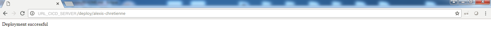

As a result, the banking application is now ready to be instantiated from the ICp catalog.

---

:thumbsup: Congratulations! Your banking application has been packaged into a Docker image using a DevSecOps approach! Ready to use it from IBM Cloud private?

---

# Step 3 - Instantiate the banking microservice from the IBM Cloud private catalog

The objective is to discover the IBM Cloud private catalog in order to instantiate a container from your Docker image containing your banking application. In this way, you will be able to test your banking application from ICp.

## Part 1 - Discover the Helm chart from the calalog

1. Subscribe to [IBM Cloud private in the Linux One Community Cloud](https://developer.ibm.com/linuxone)
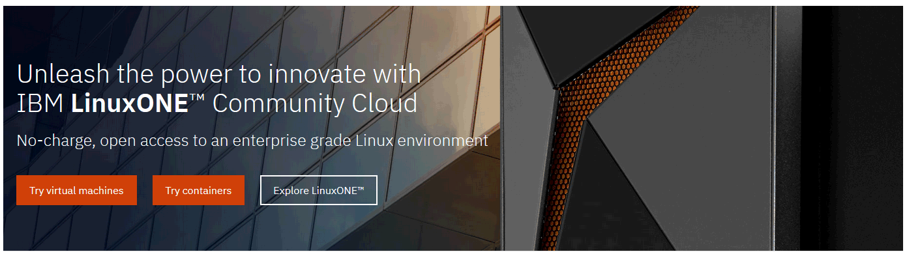
    * Click **Try IBM Cloud Private**.
    * Fill the form and submit.
    * Activate your account when you will receive the confirmation email.

2. Login to the IBM Cloud private catalog (the access link is provided in the confirmation email) Fill credentials with yours:
	
	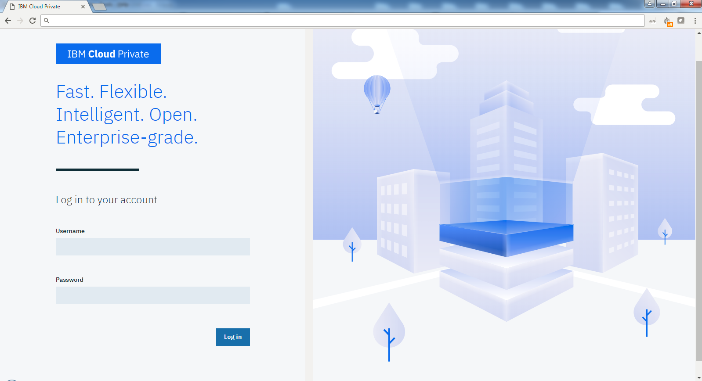
    * Replace the username by your email.
    * Replace the password by your password.

3. Click the top-right icon  from the menu to access the catalog.

	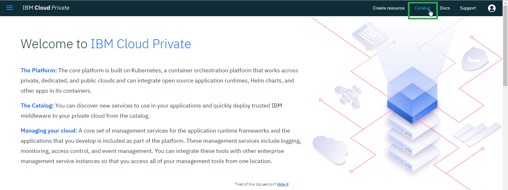
	* Click on **Catalog**.

4. Click on the Helm Chart called **openmplbank - Banking dashboard** to see the overview of the this banking microservice.

	> NOTE: If you are practicing this pattern during an IBM event like SHARE or Think, Click on the Helm Chart called **openmplbank-ibm-lab4share**

	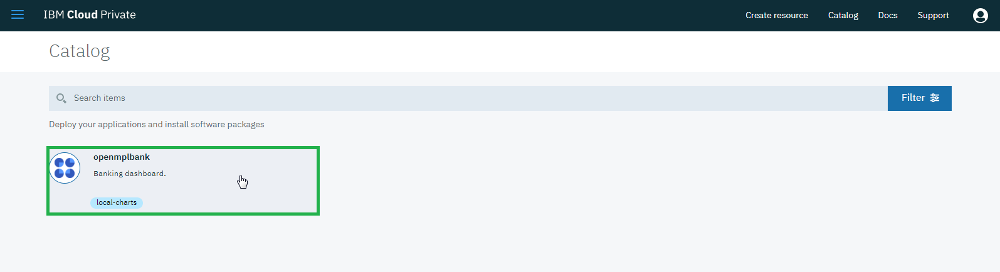

## Part 2 - Configure and install your banking microservice

1. Check the chart derails and click on configure to create your container.

	
	* Click **Configure**.

2. Configure the container:

	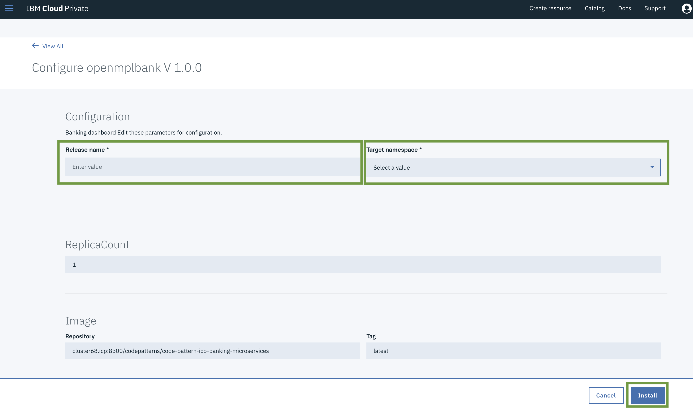
	* Fill the release name with *YOUR_USERNAME* (limit of 30 characters).
	* Select an available target namespace in the list.
	* The image repository is already filled with the Docker image defined before: **cluster68.icp:8500/codepatterns/code-pattern-icp-banking-microservices**.
	
	> NOTE: If you are practicing this pattern during an IBM event like SHARE or Think, fill the image repository with your **YOUR_IMAGE_NAME**.

3. Click the **Install** button. When the process is finished, click **View Helm Release**.

	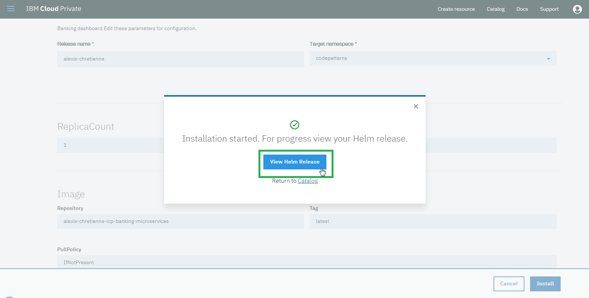
	

## Part 3 - Access your banking microservice
1. From the Helm release view, the container details are displayed.

	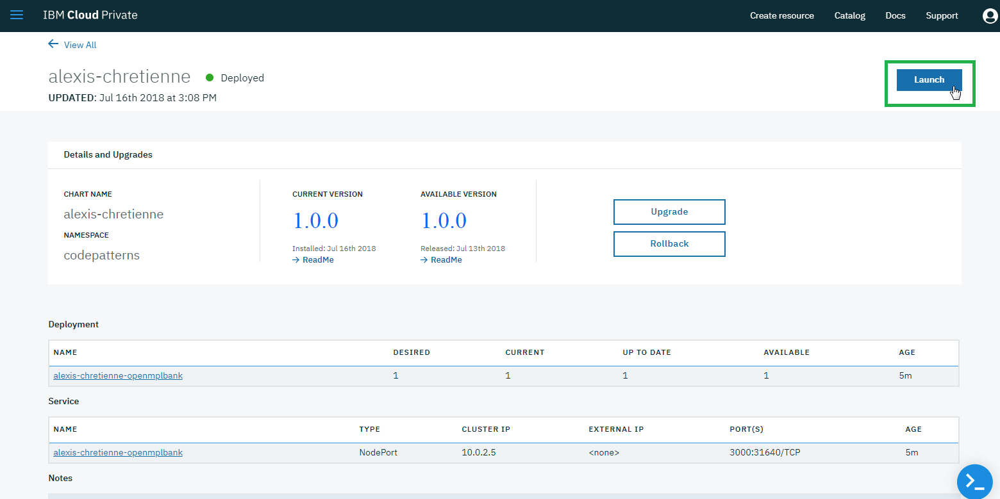
	* Click on **Launch** to display the banking microservice.

2. Test your application:
	
	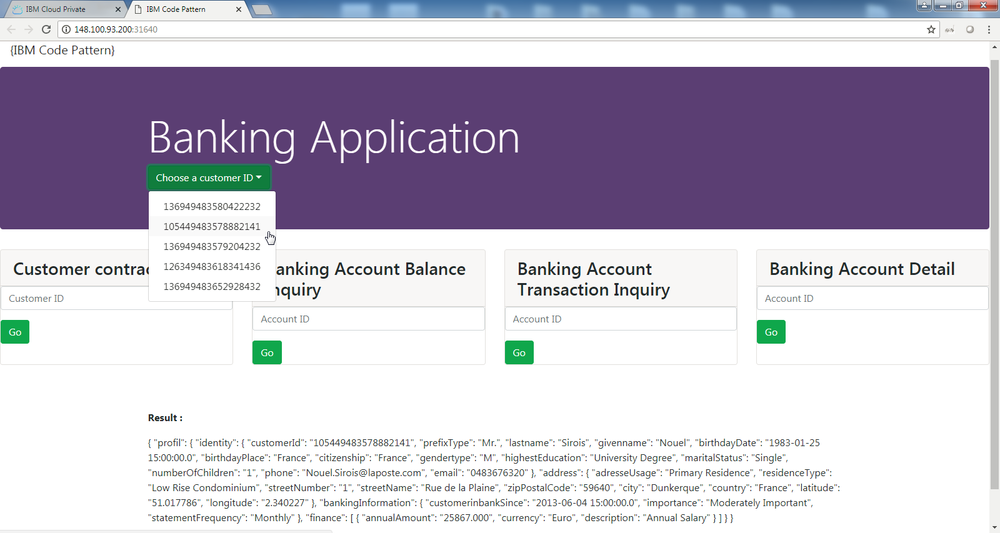
    * Select a customer ID.
    * Please wait during the application calls banking data from the Mainframe through API Connect and z/OS Connect EE.
    * The result is displayed in a JSON structure.
    
3. Your account is available for 24 hours. All your containers will removed when your account will expire.

---

:thumbsup: Congratulations! Your banking application has been instantiated from IBM Cloud Private as container. Your banking application succeeded to call banking APIs to call the Mainframe for banking business services.

---

# Licence

[Apache 2.0](http://www.apache.org/licenses/LICENSE-2.0)

# Links

* [IBM Cloud private](https://www.ibm.com/cloud/private)
* [IBM Cloud private - Knowledge Center](https://www.ibm.com/support/knowledgecenter/en/SSBS6K/product_welcome_cloud_private.html)

[IBM ID]: https://www.ibm.com/account/us-en/signup/register.html
[API Developer Portal]: https://developer-contest-spbodieusibmcom-prod.developer.us.apiconnect.ibmcloud.com/
